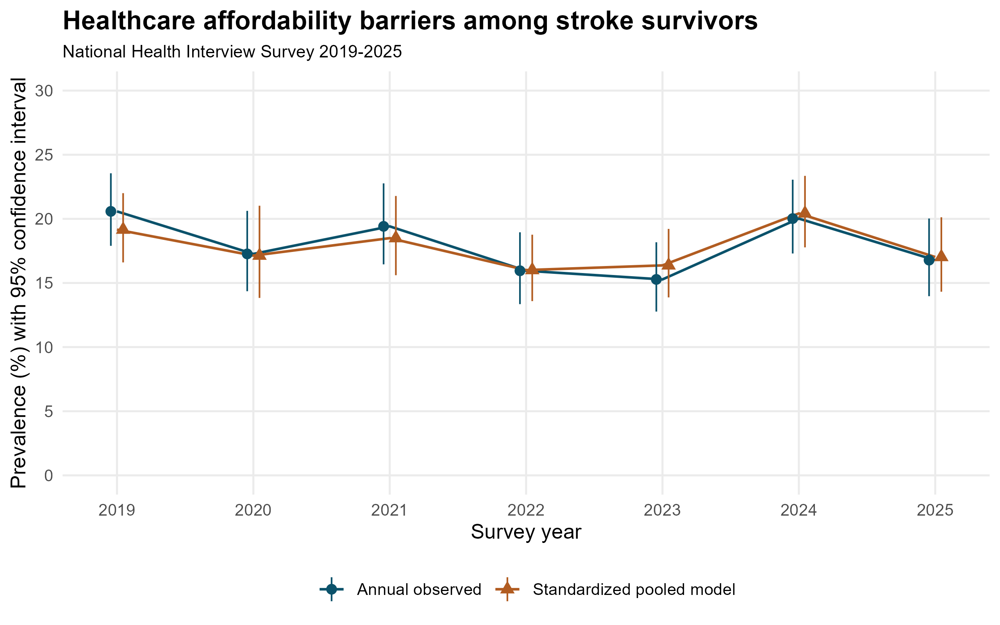
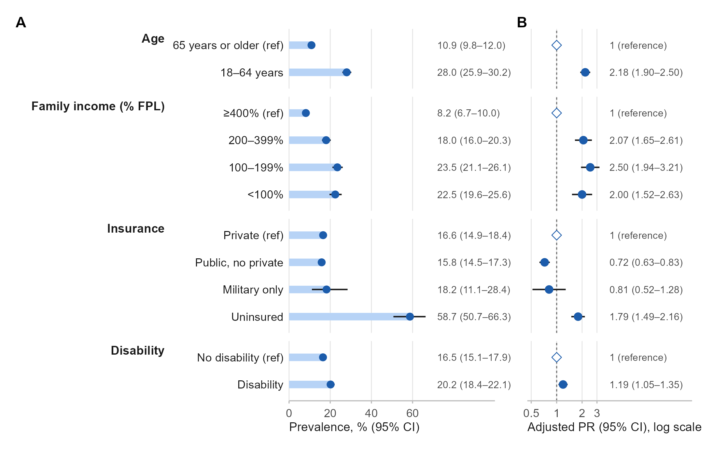

# Cost-Related Healthcare Affordability Barriers Among US Stroke Survivors From 2019 Through 2025

Working research manuscript prepared 18 September 2026

Authors: G. Blake Pierpoint^1,*^ and Alberto E. Musto^1,2,3^

^1^ Macon & Joan Brock Virginia Health Sciences Eastern Virginia Medical School at Old Dominion University, Norfolk, Virginia, USA

^2^ Department of Biomedical and Translational Sciences, Macon & Joan Brock Virginia Health Sciences Eastern Virginia Medical School at Old Dominion University, Norfolk, Virginia, USA

^3^ Department of Neurology, Macon & Joan Brock Virginia Health Sciences Eastern Virginia Medical School at Old Dominion University, Norfolk, Virginia, USA

*Correspondence: G. Blake Pierpoint, pierpogb@odu.edu

ORCID: G. Blake Pierpoint, 0000-0001-8288-8549; Alberto E. Musto, 0000-0002-0877-8883

Running title: Healthcare affordability after stroke

Article type: Original research using repeated cross-sectional national survey data

Keywords: stroke; healthcare access; affordability; medication underuse; health insurance; National Health Interview Survey

## Abstract

**Background:** Affordable medical care and medications support long-term management after stroke. We assessed contemporary healthcare affordability barriers and their distribution among US adults reporting prior stroke.

**Methods:** We analyzed the 2019–2025 National Health Interview Survey. The primary outcome was any past-year cost-related delay or nonreceipt of medical care, nonreceipt of needed prescriptions, or medication underuse among prescription users. Annual estimates used annual survey weights. Pooled analyses excluded the 2020 followback sample and used the corresponding partial-sample weights. Survey-weighted modified Poisson models estimated adjusted prevalence ratios (aPRs), with ten income imputations. Logistic models estimated standardized annual prevalence.

**Results:** The pooled sample contained 7,104 stroke-survivor records with observed outcomes; 1,184 reported a barrier, corresponding to {{pooled}}. Sequential adjusted models included 6,777 records. Prevalence was {{young}} among adults aged 18–64 years and {{older}} among those aged 65 years or older. The fully adjusted age-group aPR was {{agepr}}. Compared with income at least 400% of the federal poverty level, income of 100%–199% was associated with an aPR of {{incomepr}}. Uninsured survivors had an aPR of {{uninsuredpr}} compared with privately insured survivors; disability was associated with an aPR of {{disabilitypr}}. Standardized prevalence was {{adj2019}} in 2019 and {{adj2025}} in 2025, a difference of {{difference}}. The overall year test did not establish temporal heterogeneity (P={{yearp}}).

**Conclusions:** Approximately one in six US stroke survivors reported a healthcare affordability barrier. Barriers were concentrated among working-age and lower-income survivors and those without insurance. These data identify groups with persistent access needs but do not establish changes in stroke-specific treatment or recurrent stroke risk.

## Introduction

Long-term care after stroke depends on access to medical follow-up and medications. Clinical prevention guidance emphasizes sustained management of vascular risk factors and appropriate preventive therapies.[1] Costs can interfere with patients' ability to obtain this care. National estimates of affordability barriers among stroke survivors can therefore inform discussions about access even when the available data cannot identify the specific treatments affected.

Affordability problems after stroke have been documented for decades. An analysis of the 1998–2002 National Health Interview Survey (NHIS) found that younger stroke survivors had poorer access to physician care and medications.[2] A subsequent NHIS study covering 1999–2010 described cost-related medication nonadherence, including differences by age and insurance.[3] More recent work linked food insecurity and perceived financial stress with medication nonadherence among stroke survivors in 2014–2018.[4] Together, these studies establish that financial barriers and age differences are longstanding concerns; their existence alone would not constitute a new finding.

The contemporary period warrants an updated assessment. NHIS data from 2019–2023 have been used to examine medication nonadherence among working-age adults with multiple chronic conditions, a broader population that includes some stroke survivors.[5] The release of the 2025 NHIS permits stroke-specific estimates across seven years of the redesigned survey.[6] Considering delayed and forgone medical care alongside medication affordability provides a broader description of access than medication underuse alone. However, medical care and prescription questions are not specific to stroke prevention, and a composite measure cannot establish adherence to recommended stroke therapies.

We examined the prevalence of healthcare affordability barriers among US adults reporting prior stroke from 2019 through 2025, their annual variation, and their distribution by age, income, insurance, and disability. We also assessed whether the age-group association changed with sequential adjustment for socioeconomic and clinical characteristics. This comparison was intended to describe the association under different adjustment sets, not to estimate causal mediation or isolate the effect of Medicare eligibility.

## Methods

### Study design and population

We conducted a repeated cross-sectional analysis of public-use NHIS Sample Adult files for 2019–2025. NHIS represents the civilian noninstitutionalized US population and uses a complex, stratified, clustered sampling design.[6] The analytic domain included adults reporting that a doctor or other health professional had ever told them they had a stroke, identified by STREV_A=1. We required a positive applicable survey weight and a valid public-use age of 18–85 years; age 85 represents 85 years or older. Records with unknown age were excluded. The questions do not establish stroke subtype, event date, severity, or recurrence.

Annual estimates used each year's full Sample Adult file and annual weight, WTFA_A. For pooled analyses, we followed the special 2020 instructions: followback respondents were omitted, and the remaining 2020 records were linked to the partial file and assigned WTSA_P.[7] We used WTFA_A for other years and divided the pooled weights by seven. This prevents repeated 2019–2020 followback observations from entering the pooled analysis while retaining the intended annual 2020 estimator. Summed annual record counts should not be interpreted as unique people across years.

The public-use strata and primary sampling unit identifiers, PSTRAT and PPSU, were preserved without adding arbitrary year suffixes, consistent with NCHS guidance for pooling years since 2019, including 2025.[6] We constructed survey designs from the full eligible adult files before restricting analyses to the stroke-survivor domain. The study used existing public-use data without recruitment or intervention. The author team must supply its institutional determination, if required, rather than infer an exemption from data availability.

### Affordability outcomes

The primary outcome was any affordability barrier in the past 12 months. Three questions were asked of all sample adults: delaying medical care because of cost (MEDDL12M_A), needing but not obtaining medical care because of cost (MEDNG12M_A), and needing but not obtaining prescription medicines because of cost (RXDG12M_A). Three additional questions asked prescription users whether they skipped doses (RXSK12M_A), took less medication (RXLS12M_A), or delayed filling a prescription (RXDL12M_A) to save money. These conditional items applied when RX12M_A indicated prescription use during the preceding year.

A yes response to any applicable item established a barrier. A no-barrier classification required no responses to all three universal items and either known prescription nonuse or no responses to all three conditional items. Remaining response patterns were treated as unknown. Thus, unknown medication use or a partially unanswered all-negative pattern was not automatically coded as absence of a barrier. Structural blanks in the conditional questions were retained in the source variables, and their applicability was handled explicitly in constructing the composite.

We also estimated delayed medical care, forgone medical care, and forgone prescriptions separately. Medication underuse combined the three conditional items and used prescription users as its denominator. A three-item composite restricted to the universal questions served as a sensitivity outcome. The annual codebooks showed consistent substantive wording and universes for the stroke and affordability questions. Supplementary Methods and the accompanying crosswalks document the exact variables and response rules.

### Covariates

Demographic covariates were survey year, age, sex, race and Hispanic origin, and Census region. Age was represented by a natural cubic spline with three degrees of freedom in the principal models. We retained the seven published race and Hispanic-origin categories, including separate American Indian or Alaska Native categories, rather than assign them clinical or biological interpretations. Sex was represented using the available male/female survey variable.

Socioeconomic covariates were education, family income relative to the federal poverty level (FPL), and insurance. We harmonized EDUC_A in 2019–2020 with EDUCP_A thereafter into less than high school, high school or GED, some college or associate degree, and bachelor's degree or higher. Income categories were below 100%, 100%–199%, 200%–399%, and at least 400% FPL, using the documented RATCAT_A categories. Insurance groups were private coverage with or without public coverage; public coverage without private coverage; military coverage only; and uninsured. The uninsured recode was authoritative, and ambiguous coverage types remained missing. Public coverage included Medicare, Medicaid/CHIP, and state or other government programs. These broad groups do not measure benefit generosity, underinsurance, or changes in coverage during the preceding year.

Clinical and health-status covariates were reported hypertension, diabetes, coronary heart disease, cigarette smoking status, fair or poor self-rated health, and disability. Disability used DISAB3_A, the Washington Group-based recode identifying substantial difficulty in at least one functional domain. This measures current functional difficulty, not disability necessarily caused by stroke. Smoking categories were never, former, and current; indeterminate status was missing.

### Missing data and statistical analysis

NCHS supplies ten imputed income datasets for each study year.[8] We linked income records by household identifier within year, matched the imputation index across years, fit models separately in all ten completed datasets, and combined estimates and variances using Rubin's rules with finite design degrees of freedom. The initial project outline incorrectly anticipated five imputations; inspection of the files and technical documents established that ten were available and all ten were used. This correction preceded estimation of the full models. Other missing covariates were not imputed. Sequential models used the same complete nonincome-covariate sample, and descriptive estimates used all records with an observed outcome.

We calculated unweighted record counts and survey-weighted percentages. Annual prevalence confidence intervals used a logit transformation. Pooled component intervals used a beta interval based on a design-adjusted effective sample size; subgroup and standardized estimates were pooled on the logit scale. Taylor linearization accounted for stratification and clustering.[9] Supplementary Methods provide interval details and the precision screen informed by NCHS presentation standards.[12]

Survey-weighted modified Poisson models with robust variance estimated adjusted prevalence ratios (aPRs).[9,10] Model 1 included year and demographic characteristics. Model 2 added education, income, and insurance. Model 3 added the clinical and health-status covariates. A separate set of sequential models replaced the continuous-age spline with age 18–64 versus 65 years or older; the group comparison was not adjusted for the continuous age that defines it. All covariates were retained regardless of statistical significance.

Logistic models with the Model 3 covariates estimated annual prevalence standardized to the pooled complete-case covariate distribution.[11] Uncertainty included both model estimation and the estimated reference distribution. We estimated the standardized absolute difference between 2025 and 2019. Approximate pooled multivariate Wald F tests assessed categorical year and a year-by-age-group interaction, using Rubin-pooled covariance and the minimum scalar degrees of freedom for the tested coefficients. We did not impose a linear trend. Year-by-insurance interaction models were not pursued because the military-only group contained only 109 outcome-observed records and 17 events across all seven years, limiting support for an expanded interaction.

Sensitivity analyses excluded 2020, restricted the sample to working-age adults or adults without disability, used individual component outcomes, and assigned explicit unknown categories to otherwise missing nonincome covariates. The last analysis was a diagnostic rather than a correction for missing-data bias. Because modified Poisson models can yield fitted values above one, we additionally estimated key prevalence-ratio contrasts from bounded logistic predictions. These standardized contrasts are related to, but not identical to, the conditional modified Poisson estimands.

Analyses used R 4.6.0, survey 4.5, and mitools 2.4. Independent Python calculations reproduced primary prevalence estimates, Taylor standard errors, the first-imputation full-model coefficients and covariance, and Rubin pooling across all 16 modified Poisson specifications. P values were two-sided, with no multiplicity adjustment; secondary contrasts and sensitivity analyses were exploratory. The analysis was not preregistered, and the full covariate specification was recorded after initial descriptive results were available. Reporting follows the STROBE framework, with a draft checklist in the supplement.[13]

## Results

### Analytic sample

The seven annual files contained 207,064 Sample Adult records, including 7,565 reporting prior stroke. After excluding 10 records with unknown age, 7,555 stroke-survivor records remained for annual analyses, of which 7,476 had an observed primary outcome. After applying the 2020 partial-sample approach, the pooled stroke sample contained 7,181 records. Of these, 77 (1.1%) had an unknown primary outcome, leaving 7,104 records, including 1,184 with a barrier. The complete-covariate model sample contained 6,777 records and 1,117 events (Figure S1).

In the pooled outcome-observed sample, 41.0% were aged 18–64 years, 51.5% were female, 38.8% had disability, and 51.9% reported fair or poor health. Public insurance without private coverage accounted for 53.6%, private coverage for 40.3%, and uninsured status for 4.0% of the weighted sample (Table 1). Income was flagged as imputed for 1,923 of the 7,181 pooled stroke records (26.8% unweighted; 28.3% weighted). Smoking had the most missing covariate values, affecting 253 pooled stroke records (3.5%). Of the 7,104 records with observed outcomes, 327 (4.6%) were excluded from complete-case models because at least one adjustment variable was missing.

### Prevalence and annual variation

The pooled prevalence of any affordability barrier was {{pooled}}. Delayed medical care affected {{delayed}}, forgone medical care {{forgonecare}}, and forgone needed prescriptions {{forgonerx}}. Medication underuse among prescription users affected {{underuse}}. The universal three-item composite prevalence was {{universal}}. These outcomes overlap and should not be added together (Table S4).

Observed annual prevalence was 20.6% in 2019, 17.3% in 2020, 19.4% in 2021, 16.0% in 2022, 15.3% in 2023, 20.0% in 2024, and 16.8% in 2025 (Table 2; Figure 1). After standardization, the estimates were {{adj2019}} in 2019 and {{adj2025}} in 2025. The 2025-minus-2019 difference was {{difference}}. The overall categorical-year test yielded P={{yearp}}, and the year-by-age-group interaction yielded P={{interactionp}}. These results do not establish a monotonic decline, equivalence across years, or identical trajectories between age groups.

### Differences across survivor groups

The unadjusted prevalence was {{young}} among working-age adults and {{older}} among older adults. The age-group aPR was 2.51 (95% CI, 2.20–2.87) in Model 1, 2.27 (1.98–2.61) in Model 2, and {{agepr}} in Model 3 (Table 3). Adjustment reduced but did not eliminate the age-group association.

Affordability barriers were reported by 8.2% of survivors with income at least 400% FPL, 18.0% with income 200%–399% FPL, 23.5% with income 100%–199% FPL, and 22.5% with income below 100% FPL. Relative to the highest-income group, fully adjusted PRs were {{income200pr}}, {{incomepr}}, and {{incomelowpr}}, respectively. The income pattern was not strictly graded between the two lowest-income categories.

Uninsured survivors had a prevalence of {{uninsuredprev}}, compared with {{privateprev}} among privately insured survivors and {{publicprev}} among those with public coverage without private insurance. In Model 3, uninsured status was associated with an aPR of {{uninsuredpr}}, whereas public coverage without private insurance was associated with an aPR of {{publicpr}}, both relative to private coverage. The military-only comparison was imprecise. Survivors with disability had a prevalence of {{disabilityprev}}, compared with {{nodisabilityprev}} among those without disability; the fully adjusted aPR was {{disabilitypr}}.

Other Model 3 associations included higher prevalence among female respondents, those reporting coronary heart disease, current smokers, and those with fair or poor self-rated health. High school/GED and less-than-high-school categories had lower adjusted prevalence than the bachelor's-or-higher category. These education estimates represent conditional associations after income and health adjustment and should not be interpreted as protective effects of less education. Full coefficients are provided in Table S5 and the accompanying machine-readable results.

### Sensitivity analyses

Excluding 2020 produced similar estimates for income of 100%–199% FPL (aPR, 2.59; 95% CI, 2.00–3.36), uninsured status (1.82; 1.49–2.21), and disability (1.18; 1.04–1.34). The universal composite, separate care and prescription outcomes, and missing-category diagnostic also supported the direction of these associations (Table S6). Among working-age adults, the disability estimate was smaller and less precise (aPR, 1.08; 95% CI, 0.92–1.27); the overall disability association should therefore not be assumed to apply equally within each age group.

The full modified Poisson model had 14–16 fitted values above one per imputation, representing approximately 0.2% of its 6,777 records. These values were not interpreted as individual probabilities. Bounded logistic standardization gave PRs of {{logage}} for working age, {{logincome}} for income of 100%–199% FPL, {{loguninsured}} for uninsured status, and {{logdisability}} for disability (Table S7). Complete-case prevalence was 17.8%, compared with 19.2% among the 327 outcome-observed records excluded for missing covariates; the latter estimate had a wide interval (14.0%–25.5%). This comparison and the missing-category analysis cannot exclude selection bias.

## Discussion

In this national repeated cross-sectional study, approximately one in six adults reporting prior stroke experienced a healthcare affordability barrier during the preceding year. Working-age adults, survivors with lower family income, and uninsured survivors had particularly high prevalence. The adjusted age-group association persisted after accounting for socioeconomic and health characteristics. Disability also identified greater overall burden, although the within-working-age estimate was smaller and uncertain. Annual estimates fluctuated, and the adjusted analyses did not provide clear evidence of overall temporal heterogeneity across 2019–2025.

These findings extend earlier stroke-survivor access studies to a contemporary seven-year period and a multidomain outcome. Earlier NHIS analyses documented reduced access among younger survivors and age differences in medication affordability.[2,3] Work using 2014–2018 data linked financial stress and food insecurity to medication nonadherence after stroke.[4] Our findings are consistent with the continued relevance of financial constraints, while adding medical-care delays and nonreceipt to the outcome. Estimates are not directly interchangeable with those earlier studies because survey design, age eligibility, time period, and outcome definitions differ. The present composite is broader than the medication nonadherence measure evaluated in the 2019–2023 study of adults with multiple chronic conditions.[5]

The age-group association deserves attention without being reduced to an insurance explanation. Its decrease across sequential models indicates that the measured socioeconomic characteristics account statistically for part of the difference. Nevertheless, aPRs remained above two after full adjustment. Age categories also capture differences in employment, family obligations, lifetime resources, disease history, and access to public coverage that these files do not fully characterize. Insurance and income may be consequences as well as antecedents of poor health. The sequential comparison therefore cannot quantify how much of the age difference would disappear after an insurance intervention or at the age of Medicare eligibility.

The marked burden among uninsured survivors supports considering both coverage and the affordability of actual care in discussions about stroke follow-up. However, insured survivors also reported barriers. Public coverage without private insurance was associated with lower adjusted prevalence than private coverage, but this does not establish that one insurance arrangement causes better access. The categories combine different programs, supplemental coverage, benefit structures, eligibility pathways, and health profiles. Insurance is measured at interview, whereas barriers refer to the previous year, creating additional potential for mismatch. The observed income associations likewise describe differences in reported access, not causal effects of changing household income.

Disability can be accompanied by substantial care needs and practical difficulty accessing services. The association between the survey's functional-disability measure and affordability barriers persisted after adjustment for income, insurance, and several health characteristics. Yet the disability measure is not stroke-specific, and the working-age sensitivity estimate was compatible with both a modest increase and no association. More detailed studies could distinguish mobility, communication, cognitive, and self-care limitations and examine how affordability interacts with transportation, caregiver support, and accessibility. Those dimensions are not resolved by the present composite.

The year pattern should be interpreted cautiously. Observed prevalence was lower in 2022–2023 than in 2019 and returned near the 2019 estimate in 2024, but confidence intervals were broad and the full-model year test was not conclusive. The endpoint difference was compatible with either a modest increase or a decrease. These data therefore do not support a claim that affordability steadily improved or worsened. Changes in healthcare use and perceived need can also alter reports of delayed or forgone care, even when prices or insurance generosity are unchanged. We did not estimate effects of pandemic policies, insurance reforms, or other specific interventions.

For clinical practice and service planning, the results support attention to affordability when discussing follow-up and medications with stroke survivors, especially those facing the measured socioeconomic disadvantages. A practical assessment would distinguish the inability to obtain a prescription from dose reduction or missed visits, because those problems may require different responses. This implication is a service-planning inference from reported barriers; the study did not test a screening program, assistance intervention, or effect on recurrent vascular events. NHIS cannot identify whether the affected medications were antithrombotics, lipid-lowering drugs, antihypertensives, or treatments unrelated to stroke.

### Strengths and limitations

Strengths include national survey data through 2025, verification of annual question wording and universes, explicit handling of prescription-use applicability, appropriate 2020 pooling weights, incorporation of all ten income imputations, and parallel descriptions of absolute prevalence and adjusted associations. Use of the same sample for sequential models supports a meaningful comparison of estimates across adjustment sets. Independent numerical replication and bounded logistic sensitivity analyses increase confidence in the computational implementation, although they cannot validate the causal assumptions or completeness of the measured constructs.

Several limitations constrain interpretation. First, stroke history, affordability, and most covariates were self-reported and subject to recall or reporting error. Stroke subtype, timing, severity, and recurrence were unavailable, and some barriers could predate the reported stroke. Second, the noninstitutionalized population excludes many survivors with the greatest disability or care needs; results may not generalize to nursing facilities or other institutions. Nonresponse and changing survey participation can remain relevant despite weighting. Third, the composite assigns equal positive status to different barriers and does not measure frequency, duration, clinical importance, or whether needed care was related to stroke. Prescription nonuse is handled explicitly, but opportunity to experience medication underuse still varies across individuals.

Fourth, current insurance and functional status may not reflect their values when a past-year barrier occurred. Important determinants such as wealth, out-of-pocket spending, benefit generosity, transportation, treatment indication, and stroke severity were not measured in these models. Adjustment for current health may also condition on consequences of earlier access, so fully adjusted estimates have a descriptive rather than causal interpretation. Fifth, complete-case exclusion of nonincome missingness could bias associations; income imputation depends on NCHS model assumptions. Sensitivity analyses do not eliminate these concerns. Sixth, rare covariate combinations generated a small number of modified Poisson fitted values above one. Logistic analyses supported the main patterns, but the resulting marginal PRs have a different estimand. Finally, subgroup estimates can be imprecise, the joint tests use an approximate MI procedure, and multiple exploratory comparisons increase the possibility of chance findings. The study was not preregistered and is not a formal evaluation of policy effects.

## Conclusions

Healthcare affordability barriers affected approximately one in six US stroke survivors during 2019–2025, with substantial concentration among working-age and lower-income adults and those without insurance. The data did not establish a consistent improvement across years. These findings describe continuing access needs among people living with a history of stroke and support more detailed evaluation of the care and medications that financial barriers interrupt.

## Declarations

**Ethics and consent:** This secondary analysis used publicly available, de-identified NHIS files released by NCHS. No participants were recruited, no new consent was obtained, and institutional review was not required for this analysis.

**Competing interests:** The authors declare no competing interests.

**Author contributions:** G. Blake Pierpoint: Resources; Software; Supervision; Validation; Visualization; Writing – original draft; Writing – review & editing; Investigation; Methodology; Data curation; Formal analysis. Alberto E. Musto: Conceptualization; Supervision; Validation; Investigation; Methodology; Project administration; Writing – review & editing; Data curation; Formal analysis.

**Data and code availability:** The NHIS public-use files and documentation are available from NCHS, and no agency endorsement is implied. All acquisition, analysis, verification, and manuscript-generation code, source URLs with file hashes, aggregate results, tables, and figures are publicly available at https://github.com/blakepi/nhis-stroke-affordability; the version analyzed here is tagged as release v1.0.0 (https://github.com/blakepi/nhis-stroke-affordability/releases/tag/v1.0.0).

**Use of automated assistance:** Automated tools assisted with data processing, statistical programming, numerical checks, and manuscript drafting. The authors are responsible for the scientific interpretation and the final text; this disclosure should be adapted to the target journal's requirements.

## References

{{references}}

## Tables

{{main_tables}}

## Figures and legends

### Figure 1 Annual observed and standardized prevalence

Points and bars show estimates and 95% confidence intervals. Observed annual estimates use full annual samples and weights. Standardized estimates use logistic models in the pooled complete-case sample, the 2020 partial-sample weights, ten income imputations, and the pooled covariate distribution. The two series therefore differ in population composition and estimation method as well as adjustment. The outcome combines cost-related care delay, forgone care, forgone prescriptions, and medication underuse among prescription users.

### Figure 2 Adjusted prevalence ratios for selected survivor characteristics

Estimates are from the fully adjusted survey-weighted modified Poisson model and ten income imputations. The age contrast comes from a separate model replacing the age spline with age group. Other contrasts use the spline-age model. Bars are 95% confidence intervals; the dashed line indicates a PR of one. Private coverage includes concurrent public coverage. FPL indicates federal poverty level. These are descriptive associations, not estimated effects of interventions.
