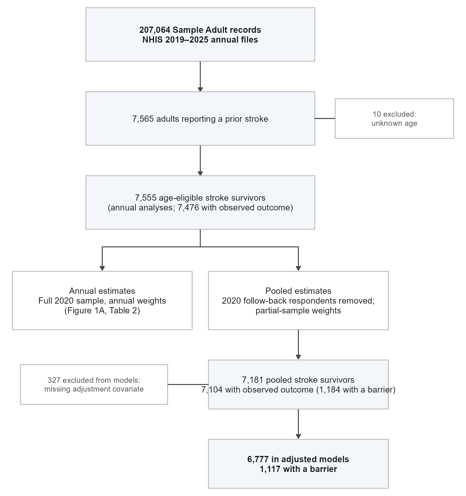

# Supplementary Material

Cost-Related Barriers to Care and Medications Among US Stroke Survivors, 2019–2025

G. Blake Pierpoint and Alberto E. Musto

Reference numbers refer to the reference list of the main manuscript.

## Supplementary Methods

### Data sources and harmonization

Microdata came from the seven annual NHIS Sample Adult files for 2019–2025, the seven annual multiply imputed income files, and the 2020 partial Sample Adult file. Documentation comprised the annual Sample Adult codebooks, survey descriptions, and income imputation technical documents. The download location, size, and SHA-256 hash of each of the 36 files are recorded in the source manifest distributed with the analysis code.

A questionnaire crosswalk records the exact wording, response universe, and codebook page of each stroke and affordability question in every year; a covariate crosswalk does the same for education, insurance, clinical, smoking, and disability variables. Question wording and universes were substantively identical across 2019–2025 after normalizing capitalization in the 2019 prescription-use item. Stroke history was defined as a reported prior clinician diagnosis; neither subtype nor recency was inferred.

Annual estimates retain the full 2020 Sample Adult file, including follow-back respondents, with the annual weight WTFA_A. Pooled estimates retain only the 2020 records that link to the partial file and use the partial-sample weight WTSA_P, matching households on the partial-file identifier. All other years use WTFA_A. Pooled weights were divided by seven so that weighted totals represent an average annual population; no total is presented as a count of unique survivors across years.

Survey designs were specified on the full adult files using the published stratum (PSTRAT) and primary sampling unit (PPSU) identifiers, which NCHS instructs users to combine across years without modification for 2019 onward. Domain estimation for stroke survivors retained the full design, so variance estimates account for the fact that the stroke domain is a subset of each sampling unit.

### Outcome classification

{{outcome_definitions}}

Response codes 1 and 2 indicate "yes" and "no." Refused, not ascertained, don't know, and missing responses were never recoded as "no." Any applicable "yes" defined a positive composite even if another component was unknown. An all-negative composite required a known response to every applicable item. Prescription nonuse (RX12M_A=2) is an explicit branch that leaves the three medication-use items structurally blank; if prescription use was unknown and all universal items were negative, the primary outcome was classified as unknown. The medication-underuse denominator includes only respondents who reported prescription use and had a classifiable underuse outcome.

### Covariate definitions

{{covariate_definitions}}

For the individual coverage indicators, codes 1 and 2 both indicate coverage and code 3 indicates no coverage; the uninsured variable NOTCOV_A codes 1 as not covered and 2 as covered. The insurance hierarchy assigned private coverage first among covered respondents, then public coverage without private coverage, then military coverage only when every other listed coverage type was explicitly absent. Ambiguous coverage patterns were set to missing. Private coverage may coexist with public or military coverage, and public-without-private coverage may coexist with military coverage; military-only status is therefore deliberately narrow.

Income used the categorical poverty-ratio variable RATCAT_A rather than the rounded continuous ratio. Categories 1–3 correspond to below 100% of the federal poverty level (FPL), 4–7 to 100%–199%, 8–11 to 200%–399%, and 12–14 to 400% or higher. The imputation index is named IMPNUM in 2019–2020 and IMPNUM_A thereafter. All ten annual imputations were linked by year, household, and index, with assertions of unique keys and complete matching. In descriptive tables the income point estimate is the mean of the ten completed-data weighted percentages, and unweighted income counts are averages over imputations, which is why they may be fractional.

### Estimands and models

The primary descriptive estimand is the survey-weighted prevalence of any cost-related barrier among noninstitutionalized adults reporting prior stroke with a classifiable outcome. Adjusted prevalence ratios condition on the stated covariate set and are descriptive associations, not causal effects, incidence ratios, or recurrence estimates. Model 1 adjusts for categorical year, an age spline, sex, race and Hispanic origin, and region. Model 2 adds education, income, and insurance. Model 3 adds hypertension, diabetes, coronary heart disease, smoking, self-rated health, and disability. All three models use the same 6,777 records. The age-group model sequence substitutes a working-age indicator for the age spline.

For each model, coefficients were averaged over the ten imputations. The total covariance equals the mean within-imputation survey covariance plus 1.1 times the between-imputation covariance of the coefficients. Confidence intervals use the finite-sample degrees of freedom returned by mitools::MIcombine, supplied with the minimum residual design degrees of freedom across the ten fits. Poisson coefficients were exponentiated to obtain prevalence ratios. This procedure propagates income-imputation uncertainty; it does not impute missing outcomes or other covariates.

For standardized annual prevalence, the fitted logistic model assigned each survivor to each survey year in turn while holding other covariates fixed, and the predicted probabilities were averaged with the pooled complete-case weights. The linearized influence function includes the regression-coefficient influence multiplied by the prediction gradient and the weighted deviation of each predicted probability from its standardized mean, so the covariance incorporates uncertainty in the reference distribution and its covariance with model estimation. Imputation-specific margins and their covariance were pooled on the logit scale; the 2025-minus-2019 absolute difference was pooled on the probability scale.

The bounded logistic sensitivity applied the same standardization to income, insurance, disability, and the age-group model, assigning the full analytic sample to the comparison and reference categories in turn and forming their prevalence ratio. These marginal estimands differ from conditional modified Poisson prevalence ratios and can involve extrapolation to sparsely supported covariate combinations; agreement between the two approaches is a model-sensitivity observation rather than proof of correct specification.

The categorical-year and year-by-age-group tests are pooled Wald F statistics based on the selected coefficients and their Rubin total covariance, with denominator degrees of freedom equal to the minimum scalar pooled degrees of freedom among those coefficients. This is an approximate multivariate multiple-imputation test; because the missing-information fractions for the year terms were small, it provides a practical summary, and the estimates and intervals remain the primary description of annual variation.

### Confidence intervals and precision screen

Annual observed confidence intervals are design-based logit intervals. For pooled component estimates, an effective sample size was calculated from the prevalence and its Taylor variance, capped at the observed sample size and adjusted by the squared ratio of the 0.975 normal quantile to the corresponding design-based t quantile; beta quantiles based on that effective sample size provide bounded intervals. Subgroup intervals were pooled across imputations on the logit scale.

Following NCHS data presentation standards,[11] a proportion was flagged when its unweighted or effective sample size was below 30, its confidence-interval width exceeded 0.30, or its width exceeded 0.05 and was more than 130% of the smaller of the estimate and its complement; design degrees of freedom below eight prompted review. All main annual, component, and reported subgroup estimates passed. The unknown-insurance subgroup (29 records) failed the screen and is not reported.

### Sensitivity analyses and verification

Component-outcome models used the primary-model complete-covariate population restricted to observed values of the component, so their denominators differ from the broader component prevalence denominators. The no-disability model omits the disability term. The working-age model retains a continuous age spline within ages 18–64 years. The no-2020 model removes 2020 records and the corresponding year level. The missing-category analysis retains all 7,104 observed primary outcomes and includes explicit unknown levels for incomplete nonincome covariates.

All 160 modified Poisson fits and all 20 bounded logistic fits converged. The fully adjusted modified Poisson model produced 14–16 fitted values above one per imputation, with a maximum of approximately 1.9; these are reported as diagnostics and were not interpreted as individual probabilities. Independent verification in Python reconstructed 12 annual and pooled primary estimates and their Taylor standard errors directly from the source files, reproduced the first-imputation fully adjusted model from the exported design matrix (maximum absolute coefficient discrepancy below 3×10^-13; maximum covariance discrepancy below 3×10^-9), and checked Rubin-pooled means and standard errors for all 16 model specifications.

### Analytic decisions

Employment status was not included because it overlaps strongly with age and disability and would have required additional harmonization across years. A year-by-insurance interaction was not fit because the military-only group contributed only 109 observed records and 17 events across the seven years. No data-driven significance criterion was used to select the final model. The ten records with unknown age were excluded rather than imputed.

## Supplementary Tables

{{supplement_tables}}

## Supplementary Figure

**Figure S1. Selection of the annual and pooled analytic samples.** Annual and pooled samples apply different inclusion and weighting rules for 2020. The 7,555 annual stroke records include the full 2020 sample; the 7,181 pooled stroke records exclude the 2020 follow-back respondents and use the partial-sample weights. Adjusted models additionally require an observed outcome and complete nonincome covariates. Counts are records, not unique persons across years.

## STROBE Checklist

{{strobe}}
